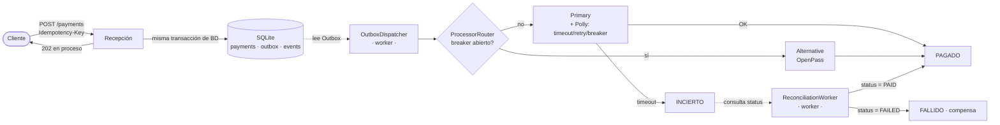
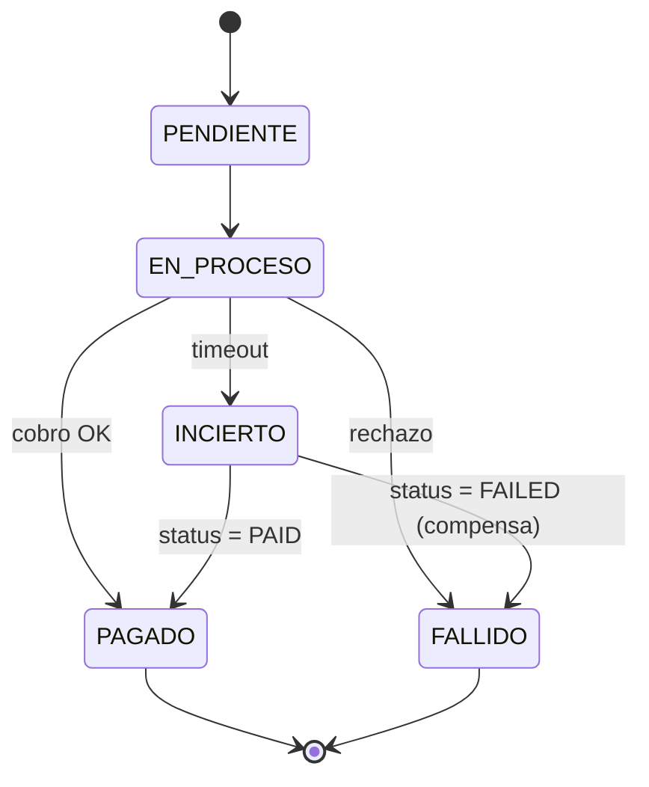

<div align="center">

# 💳 apiTransacciones

### Una API de pagos que **nunca pierde plata** — ni cuando el tercero no responde

Idempotencia end-to-end · Patrón Outbox · Circuit breaker + ruteo · Conciliación como fuente de verdad


</div>

---

## El problema

Procesar un pago contra un tercero (Stripe, Mercado Pago, un banco) es fácil cuando todo
anda. El desafío real es la **incertidumbre**: ¿qué hago cuando el procesador tarda, se cae,
o me da timeout y **no sé si cobró o no**?

Este proyecto resuelve ese ciclo de vida completo, pensado en **tres momentos**:

| # | Momento | La regla que no se negocia |
|---|---------|----------------------------|
| 1 | **Recepción** | Persisto el pago con una `Idempotency-Key` única *antes* de hablar con nadie. Misma key → mismo resultado, no reproceso. |
| 2 | **Envío** | Respondo `202 recibido` y cobro **asíncrono**. Timeout corto + circuit breaker; si falla, ruteo al procesador alternativo. |
| 3 | **Incertidumbre** | Un timeout **no** es un fallo: es "no sé". Dejo el pago en `INCIERTO` y disparo **conciliación**. Hasta que el procesador no confirma, la plata no está cobrada. |

## Arquitectura



El corazón del diseño: **recepción síncrona e idempotente** + dos workers asíncronos
(envío y conciliación) + un **log de eventos inmutable** para auditoría y replay.

## Máquina de estados (Saga)

El dinero nunca "salta" a `PAGADO` sin pasar por el procesador. Cada transición se valida.



## Los conceptos clave

| Concepto | Cómo está implementado |
|----------|------------------------|
| 🔑 **Idempotency-key end-to-end** | Header del cliente + constraint `UNIQUE`; la misma key se reenvía al procesador. |
| ⏱️ **Timeout ≠ fallo → `INCIERTO`** | Ante timeout no se asume nada; queda en verificación. |
| 🔍 **Conciliación = fuente de verdad** | Un worker consulta el `status` real del procesador; ahí se define el dinero. |
| 🔌 **Circuit breaker + ruteo** | Polly abre el breaker ante fallos y rutea al procesador alternativo (OpenPass). |
| 📦 **Patrón Outbox** *(bonus)* | Pago + evento en la **misma transacción**: si el proceso se cae, el pago no se pierde. |
| 🔄 **Saga / máquina de estados** *(bonus)* | Ciclo de vida explícito con transiciones validadas y compensaciones. |

## Consola web

Además de la API, el proyecto sirve una **consola** (SPA en `wwwroot/`, mismo origen) para
disparar pagos y ver todo en vivo — ideal para demostrar cada escenario:

- **Crear pago** con idempotency-key autogenerada + botón para reenviar la misma key y ver la idempotencia.
- **KPIs y tabla en vivo** (auto-refresh 1s): mirás `PENDIENTE → EN_PROCESO → INCIERTO → PAGADO` cambiar solo.
- **Guión del procesador** + **escenarios rápidos** (Feliz · Timeout→conciliación · Breaker→alternativo · FAILED compensa).
- **Detalle** de cada pago con el log de eventos como comprobante de auditoría.
- Botón **🗑 Limpiar** (dos clics) para resetear el tablero.

> 📊 Hay también una **presentación** de la arquitectura en [`docs/presentacion-linkedin.html`](docs/presentacion-linkedin.html).

## Cómo correr

```bash
dotnet run --project src/ApiTransacciones
```

Abrí **http://localhost:5133/** para la consola. La BD SQLite (`pagos.db`) se crea sola.

```bash
dotnet test    # 24 tests, uno por cada garantía
```

## Escenarios de demo (curl)

```bash
# Forzar el caso feo: timeout → INCIERTO → la conciliación confirma PAID → PAGADO
curl -X POST localhost:5133/demo/processor-behavior -H 'Content-Type: application/json' \
  -d '{"processor":"primary","mode":"timeout","failCount":1000,"statusResult":"PAID"}'

KEY=$(uuidgen)
curl -X POST localhost:5133/payments -H "Idempotency-Key: $KEY" \
  -H 'Content-Type: application/json' -d '{"amount":1500,"currency":"ARS","customerId":"c1"}'

curl localhost:5133/payments/{id}/events   # el log de auditoría, paso a paso
```

## Endpoints

| Método | Ruta | Qué hace |
|--------|------|----------|
| `POST` | `/payments` | Crea un pago (requiere `Idempotency-Key`). Devuelve `202`. |
| `GET`  | `/payments` | Lista todos los pagos (más nuevos primero). |
| `GET`  | `/payments/{id}` | Estado actual de un pago. |
| `GET`  | `/payments/{id}/events` | Log de eventos inmutable del pago. |
| `DELETE` | `/payments` | Limpia el tablero *(solo demo)*. |
| `POST` | `/demo/processor-behavior` | Configura el guión del procesador falso. |

## Estructura

```
src/ApiTransacciones/
  Domain/        Payment · PaymentState · PaymentStateMachine · DomainEvents
  Persistence/   PaymentsDbContext · OutboxMessage · EventLog(Entry)
  Processors/    IPaymentProcessor · FakeProcessor · ProcessorBehavior · ProcessorRegistry
  Resilience/    ResiliencePipelineFactory (Polly) · ProcessorRouter
  Workers/       OutboxDispatcher · ReconciliationWorker
  Api/           PaymentsEndpoints · DemoEndpoints · Dtos
  wwwroot/       index.html (consola web)
tests/           24 tests xUnit (integración + unitarios)
docs/            spec de diseño · plan de implementación · presentación
```

## Stack

**.NET 10** Minimal API · **EF Core + SQLite** · **Polly v8** (timeout + retry + circuit breaker)
· `BackgroundService` como cola · **xUnit** + `WebApplicationFactory` + `FakeTimeProvider`.

> El procesador de pago es **simulado** (in-memory, con "guiones" configurables) para
> demostrar cada escenario sin infraestructura externa. Los patrones son de producción; la
> integración con un procesador real es cambiar una implementación de `IPaymentProcessor`.

---

<div align="center">
<sub>Diseño, arquitectura y desarrollo — recepción idempotente · envío resiliente · conciliación como fuente de verdad.</sub>
</div>
